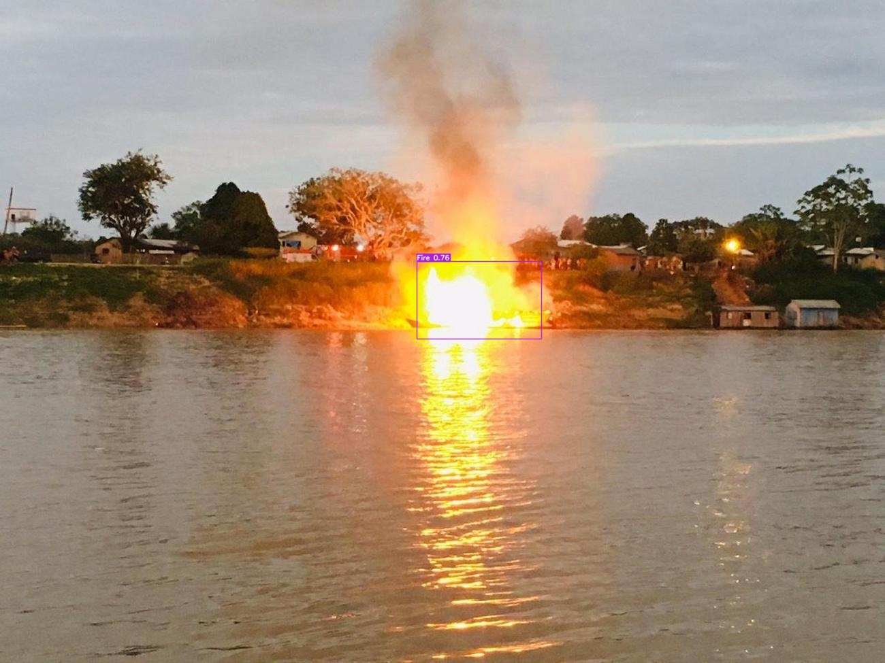
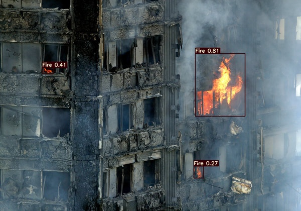
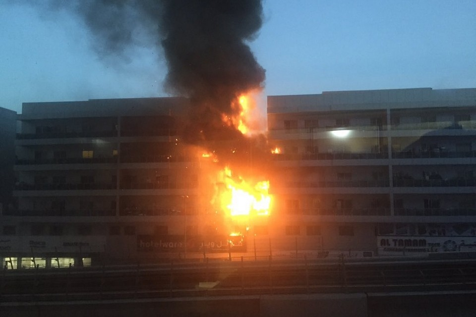
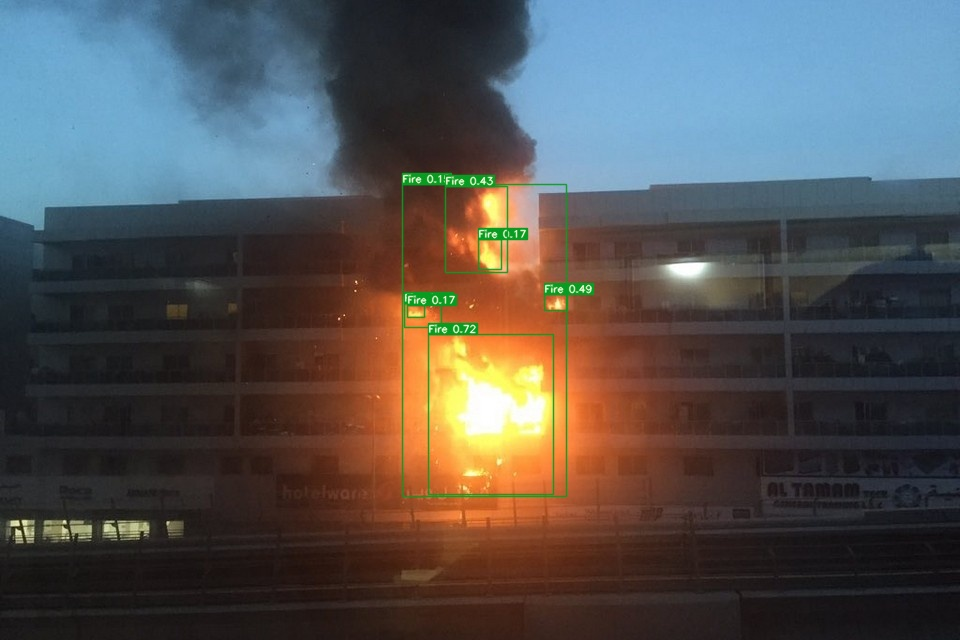
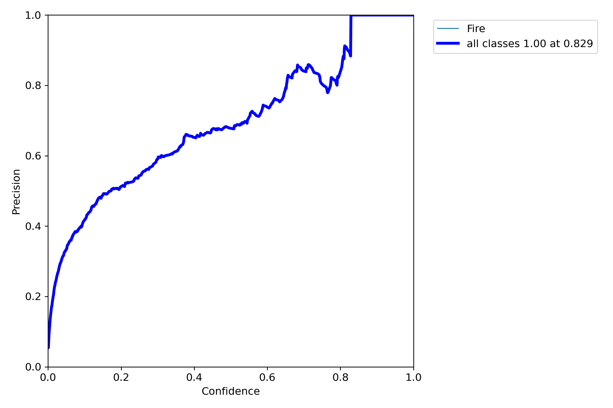
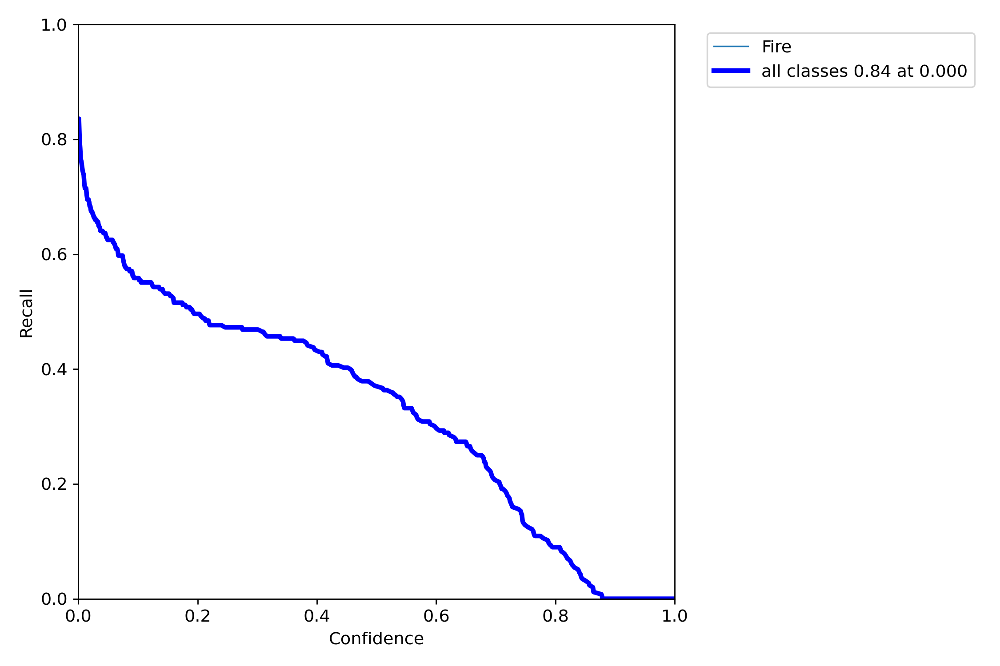
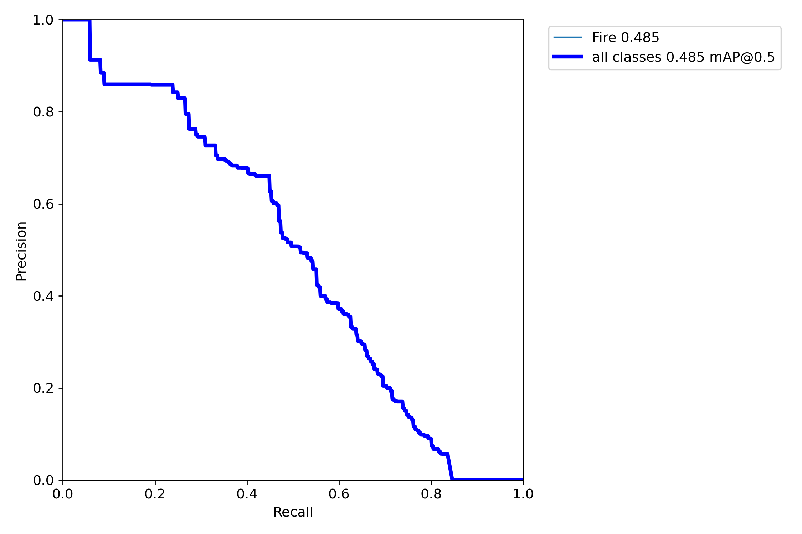
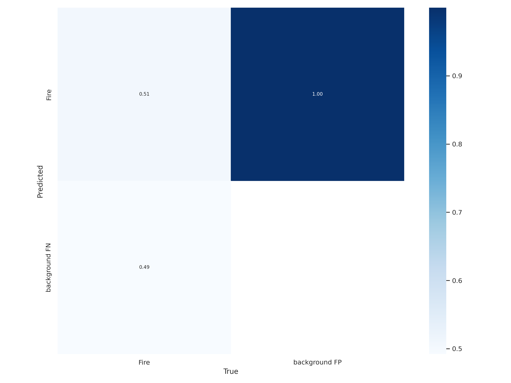

# yolov7-fire-detection


Implementation of a fire detection model to trace fire from  video or image.This model is build based on original [yolov7](https://github.com/WongKinYiu/yolov7) by [WongKinYiu](https://github.com/WongKinYiu) 

<p align="center">
  


## Install Dependencies

### Clone this repository
```
git clone https://github.com/vishnuvskvkl/yolov7-fire-detection.git
cd yolov7-fire-detection
```
#### Create a new environment to run the model
```
conda create -n <environment_name> python=3.9

conda activate <environment_name>
```
For training we have to create an environment in pytorch with cuda support.

```
pip install -r requirements.txt
```


### Clone the official yolov7 repository 

```
git clone https://github.com/WongKinYiu/yolov7.git
cd yolov7
```
### Creating custom dataset
For custom train the model I used fire dataset from [Roboflow](https://universe.roboflow.com/dataset-9xayt/fire-data-annotations-lwfou/dataset/1) which contains 2005 images and their labels in yolov7 format. You can either download or get the dataset using roboflow api key. Put it under the folder ```data```

```txt
data
    |train
        |images
        |labels
    |val
        |images
        |labels

```

#### Start Custom Training
Replace the ```coco.yaml``` file in folder data with ```data.yaml``` and change the number of classes in ```cfg>training>yolov7.yaml``` to 1 

Download yolov7 weight files from [here]('https://github.com/WongKinYiu/yolov7/releases/download/v0.1/yolov7.pt') and put it inside the directory.

Beign Custom training by executing the command
```
python train.py --batch 16 --cfg cfg/training/yolov7.yaml --epochs 10 --data data/data.yaml --weights 'yolov7.pt' --device 0 
```
Once the training is completed the model can be found at runs>train>weights as best.pt 
We can use this model for feature detection(either you can use your own trained model or the pretrained model released within this repository) by the command
```
python detect.py --weights /content/yolov7/runs/train/exp2/weights/best.pt --conf 0.1 --source 92.jpg
```
<p float="left">
  
   
</p>


or for video
```
python detect.py --weights /content/yolov7/runs/train/exp2/weights/best.pt --conf 0.1 --source 92.mp4
```
<video src= 'result/dt_trim.mp4' width='400'>
 
 
### Results 

| Precision Curve | Recall Curve | Precision Recall Curve |
| :-: | :-: | :-: |
|  |  | 

#### Validation predictions

| Test batch label | Test batch prediction |
| :-: | :-: | 
| .jpg) | .jpg) |


### Confusion Matrix

<p align='center'>

</p>
